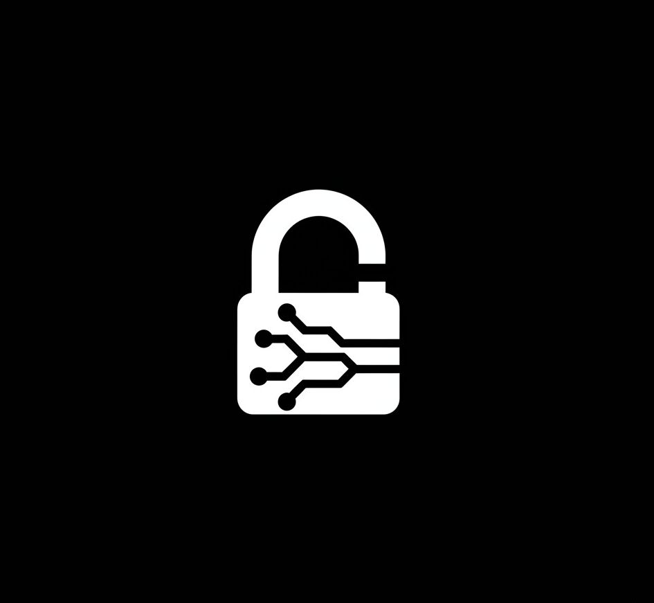
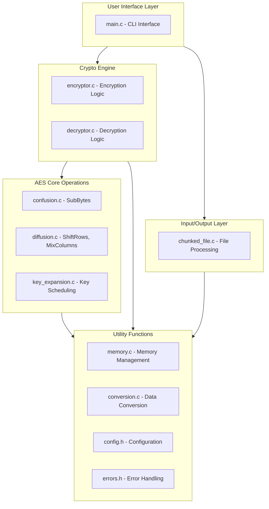
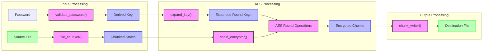

# Axon: Advanced AES Encryption CLI Tool

A high-performance, secure file encryption and decryption tool using AES-128.

  


## Table of Contents

- [Overview](#overview)
- [Features](#features)
- [Architecture](#architecture)
- [Installation](#installation)
  - [Linux](#linux)
  - [macOS](#macos)
  - [Windows](#windows)
  - [From Source](#from-source)
- [Requirements](#requirements)
- [Usage](#usage)
  - [Basic Commands](#basic-commands)
  - [Examples](#examples)
- [Security Considerations](#security-considerations)
- [Development](#development)
  - [Building from Source](#building-from-source)
  - [Running Tests](#running-tests)
- [Troubleshooting](#troubleshooting)

## Overview

Axon is a command-line tool that provides strong encryption and decryption capabilities using the Advanced Encryption Standard (AES-128) with Cipher Block Chaining (CBC) mode. It's designed for secure file protection with a focus on performance, security, and ease of use.

## Features

- **AES-128 Encryption**: Industry-standard symmetric encryption algorithm
- **CBC Mode Implementation**: Enhanced security through block chaining
- **Secure Password Handling**: Strong password validation and key derivation
- **High Performance**: Optimized C implementation for fast encryption/decryption
- **Command Line Interface**: Simple, scriptable interface for automation
- **Cross-Platform Support**: Works on Linux, macOS, and Windows
- **File Chunking**: Efficiently handles files of any size by processing in chunks
- **Error Recovery**: Robust error handling and reporting

## Architecture

### Component Architecture



### Data Flow




### Component Description

1. **User Interface Layer**
   - Handles command-line arguments
   - Validates inputs
   - Coordinates the encryption/decryption process
   - Reports results and errors

2. **Crypto Engine**
   - Implements the AES algorithm
   - Manages encryption and decryption workflows
   - Handles the CBC mode implementation

3. **AES Core Operations**
   - **Confusion**: SubBytes operation using S-Box substitution
   - **Diffusion**: ShiftRows and MixColumns operations
   - **Key Expansion**: Derives round keys from the master key

4. **I/O and Utilities**
   - File chunking and processing
   - Memory management
   - Error handling
   - Conversion utilities (hex/binary)

## Installation

### Requirements

- **Build Requirements**:
  - C Compiler (GCC 7+ or Clang 5+)
  - CMake (3.10+)
  - Make or Ninja build system
  - Git (for cloning)

- **Runtime Requirements**:
  - Linux: glibc 2.17+ 
  - macOS: 10.13+ (High Sierra or newer)
  - Windows: Windows 7 SP1 or newer

### Linux

#### Using the Install Script

```bash
git clone https://github.com/RishiAhuja/axon.git
cd axon
chmod +x install.sh
./install.sh
```

#### Manual Installation

```bash
# Clone the repository
git clone https://github.com/RishiAhuja/axon.git
cd axon

# Install using the script
chmod +x install.sh
./install.sh

# Or build manually
mkdir -p build && cd build
cmake ..
make
sudo make install
```

#### Debian/Ubuntu Package

```bash
# Download the latest .deb package
wget https://github.com/RishiAhuja/axon/releases/download/1.0.0/axon_1.0.0_amd64.deb

# Install the package
sudo dpkg -i axon_1.0.0_amd64.deb
sudo apt-get install -f  # Install any missing dependencies
```

### macOS

#### Using the Install Script

```bash
git clone https://github.com/RishiAhuja/axon.git
cd axon
chmod +x install.sh
./install.sh
```

#### Manual Installation

```bash
# Clone the repository
git clone https://github.com/RishiAhuja/axon.git
cd axon

# Install using the script
chmod +x install.sh
./install.sh

# Or build manually
mkdir -p build && cd build
cmake ..
make
sudo make install
```

Here's a detailed explanation for your README file, including the need to run Git Bash as an administrator:

---

## Windows Installation Guide

Follow these steps to install Axon on Windows. Since Windows doesn't natively support bash scripts, you'll need to set up a bash environment and ensure proper permissions.

### Prerequisites: Install Git Bash
1. **Download Git Bash**:
   - Visit [git-scm.com](https://git-scm.com) and download the latest version of Git for Windows.
   - Run the installer and follow the setup process. Use the default settings unless you need specific customizations.

2. **Verify Installation**:
   - Open Git Bash by searching for "Git Bash" in the Start Menu.
   - Run the following command to check if Git is installed:
     ```bash
     git --version
     ```
   - You should see the installed version of Git displayed.

---

### Step-by-Step Installation

#### 1. Open Git Bash as Administrator
To ensure the installation script runs smoothly, you need to open Git Bash with administrative privileges:
- **Option 1**: Manually run as Administrator:
  - Right-click on "Git Bash" in the Start Menu.
  - Select **Run as administrator**.
- **Option 2**: Always run Git Bash as Administrator:
  - Search for "Git Bash" in the Start Menu.
  - Right-click and select **Open file location**.
  - Right-click on the shortcut → **Properties** → **Compatibility** tab → Check **Run this program as administrator** → Click OK.

#### 2. Clone the Repository
Run the following commands in Git Bash:
```bash
git clone https://github.com/RishiAhuja/axon.git
cd axon
```

#### 3. Run the Installation Script
Execute the installation script to build and install Axon:
```bash
chmod +x install.sh    # Makes script executable (optional in Git Bash)
./install.sh           # Runs the installation script
```

#### 4. Add Axon to PATH Environment Variable
After installation, you need to add Axon's executable directory (`C:\Program Files (x86)\axon\bin`) to your system's PATH variable so you can use `axon` from any terminal.

1. **Find the Installation Directory**:
   By default, Axon installs to `C:\Program Files (x86)\axon\bin`.

2. **Edit PATH Variable**:
   - Press `Win + S` → Search for "Environment Variables".
   - Click "Edit the system environment variables".
   - In the "System Properties" window, click **Environment Variables**.
   - Under "System variables", find "Path" → Click **Edit**.
   - Add a new entry: `C:\Program Files (x86)\axon\bin`.
   - Click OK to save changes.

3. **Restart Terminal**:
   Close and reopen your terminal for changes to take effect.

---

### Verify Installation
To ensure Axon is installed correctly:
```bash
axon
```
You should see a help menu displaying usage instructions for Axon.

---

### Troubleshooting

1. **Command Not Found**:
   If `axon` isn't recognized:
   - Double-check that you added the correct path (`C:\Program Files (x86)\axon\bin`) to your PATH variable.
   - Restart your terminal after making changes.

2. **Permission Errors**:
   Ensure you're running Git Bash as Administrator when executing scripts or installing Axon.

3. **Dependencies Missing**:
   Ensure tools like `cmake` and a C compiler (e.g., MinGW) are installed on your system.


### From Source

For all platforms, you can build and install from source:

```bash
# Clone the repository
git clone https://github.com/RishiAhuja/axon.git
cd axon

# Create build directory
mkdir -p build && cd build

# Configure
cmake ..

# Build
cmake --build .

# Install (may require admin/sudo)
cmake --install .
```

## Usage

### Basic Commands

```bash
# Encrypt a file
axon <source_file> <destination_file> <key> e

# Decrypt a file
axon <source_file> <destination_file> <key> d
```

### Examples

```bash
# Encrypt a text file
axon confidential.txt confidential.enc "my-secure-password" e

# Decrypt the file
axon confidential.enc decrypted.txt "my-secure-password" d
```

## Security Considerations

- **Password Strength**: Use strong, unique passwords (12+ characters with a mix of types)
- **File Handling**: Securely delete sensitive plaintext files after encryption
- **Key Management**: Never store encryption keys in plaintext or share them insecurely
- **Memory Safety**: Axon implements secure memory handling to minimize exposure of sensitive data

## Development

### Building from Source

```bash
git clone https://github.com/RishiAhuja/axon.git
cd axon
mkdir -p build && cd build
cmake ..
make
sudo make install
```

### Project Structure

```
axon/                          # Root project directory
├── CMakeLists.txt             # Main build configuration
├── LICENSE                    # License file
├── README.md                  # This documentation
├── INSTALL.md                 # Detailed installation instructions
├── install.sh                 # Linux/macOS installation script
├── include/                   # Header files
│   ├── common/                # Common definitions
│   │   ├── config.h           # Configuration constants
│   │   └── errors.h           # Error codes and messages
│   ├── crypto/                # Cryptography headers
│   │   ├── aes.h              # AES algorithm interface
│   │   ├── confusion.h        # Confusion operations (SubBytes)
│   │   ├── diffusion.h        # Diffusion operations (ShiftRows, MixColumns)
│   │   ├── encryptor.h        # Encryption interface
│   │   ├── decryptor.h        # Decryption interface
│   │   └── key_expansion.h    # Key handling
│   └── utils/                 # Utility headers
│       ├── conversion.h       # Format conversion utilities
│       ├── memory.h           # Memory management utilities
│       └── file.h             # File handling utilities
├── lib/                       # Library source files
│   ├── crypto/                # Cryptography implementation
│   │   ├── aes.c              # AES algorithm implementation
│   │   ├── confusion.c        # Confusion operations implementation
│   │   ├── diffusion.c        # Diffusion operations implementation
│   │   ├── encryptor.c        # Encryption implementation
│   │   ├── decryptor.c        # Decryption implementation
│   │   └── key_expansion.c    # Key handling implementation
│   └── utils/                 # Utility implementations
│       ├── conversion.c       # Format conversion utilities
│       ├── memory.c           # Memory management utilities
│       └── file.c             # File handling utilities
├── src/                       # Application source
│   └── main.c                 # Main application entry point
├── man/                       # Manual pages
│   └── axon.1                 # Man page for the axon command
├── tests/                     # Test suite
│   ├── CMakeLists.txt         # Test build configuration
│   ├── test_aes.c             # AES algorithm tests
│   ├── test_encryption.c      # Encryption tests
│   └── test_decryption.c      # Decryption tests
├── examples/                  # Example files and scripts
│   ├── example.txt            # Sample plaintext
│   └── example.sh             # Sample usage script
└── packaging/                 # Packaging scripts
    ├── windows/               # Windows packaging
    │   └── axon.nsi           # NSIS installer script
    ├── macos/                 # macOS packaging
    │   └── axon.rb            # Homebrew formula
    └── linux/                 # Linux packaging
        └── debian/            # Debian packaging
            └── control        # Debian package control file
```

## Troubleshooting

### Common Issues

1. **"Command not found" error**
   - Make sure the installation directory is in your PATH
   - Try running with the full path to the executable

2. **"Invalid password" error**
   - Ensure the password meets the minimum requirements
   - Check for typos or encoding issues

3. **Build failures**
   - Verify you have all required build dependencies
   - Check the CMake output for specific errors

4. **Decryption errors**
   - Verify you're using the exact same password used for encryption
   - Ensure the file wasn't corrupted during transfer

### Getting Help

For additional help:
- Submit an issue on [GitHub](https://github.com/RishiAhuja/axon/issues)

