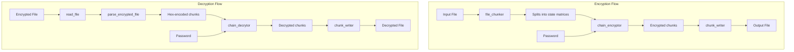

# XOR Cryptography

## Project Overview
This project is a C-based encryption and decryption system that processes files in chunks, using a password-based encryption method that operates on state matrices.

## Directory Structure
```
CPrograms/
├── .gitignore
├── CMakeLists.txt
├── README.md
├── text.txt
├── .vscode/                  # VS Code configuration
├── build/                    # Build output directory
├── include/                  # Header files
│   ├── common/               # Common definitions
│   ├── crypto/               # Encryption/decryption related headers
│   └── utils/                # Utility function headers
├── lib/                      # Implementation files
│   ├── crypto/               # Encryption/decryption implementations
│   └── utils/                # Utility implementations
└── src/                      # Main application code
    └── main.c                # Entry point
```

## Core Components

### 1. File I/O System (`lib/utils/fileio.c`)

#### Functions

- `FILE* open_file(const char* filename, const char* mode)`
  - Opens a file with the specified mode and returns a FILE pointer.
  - **Parameters:**
    - `filename`: Path to the file
    - `mode`: File open mode ("r", "w", "a", etc.)
  - **Returns:** FILE pointer or NULL if file can't be opened

- `char* read_file(const char* filename)`
  - Reads an entire file into a dynamically allocated buffer.
  - **Parameters:**
    - `filename`: Path to the file
  - **Returns:** Character buffer containing file contents or NULL on failure
  - **Implementation details:**
    - Uses dynamic memory allocation with initial buffer size of 1024 bytes
    - Doubles the buffer size when needed
    - Ensures proper NULL termination of the string

- `void flush_stream(FILE *file)`
  - Reads and displays all characters from a file stream.
  - **Parameters:**
    - `file`: File stream to flush

- `void copy_file(FILE* source, FILE* destination)`
  - Copies contents from source file to destination file.
  - **Parameters:**
    - `source`: Source file stream
    - `destination`: Destination file stream

- `void close_files(FILE *file[], int size)`
  - Closes an array of file pointers.
  - **Parameters:**
    - `file`: Array of FILE pointers
    - `size`: Size of the array

- `void write_file(const char* filename, const char* content, const int content_size)`
  - Writes content to a file.
  - **Parameters:**
    - `filename`: Path to the file
    - `content`: Content to write
    - `content_size`: Size of content in bytes

- `void append_file(const char* filename, const char* content, const int content_size)`
  - Appends content to a file.
  - **Parameters:**
    - `filename`: Path to the file
    - `content`: Content to append
    - `content_size`: Size of content in bytes

- `void init_state(const char* filename, char** state)`
  - Initializes a state matrix from file contents.
  - **Parameters:**
    - `filename`: Path to the file
    - `state`: 2D array to initialize

- `void init_state_from_contents(const char* contents, char** state)`
  - Initializes a state matrix from a string buffer.
  - **Parameters:**
    - `contents`: String buffer
    - `state`: 2D array to initialize

- `ChunkedFile file_chunker(const char* filename)`
  - Reads a file and splits it into state matrices.
  - **Parameters:**
    - `filename`: Path to the file
  - **Returns:** ChunkedFile structure containing an array of state matrices

- `int chunk_writer(const char* filename, const char** chunks, size_t chunks_len)`
  - Writes an array of chunks to a file.
  - **Parameters:**
    - `filename`: Path to the file
    - `chunks`: Array of string chunks
    - `chunks_len`: Number of chunks
  - **Returns:** EXIT_SUCCESS or EXIT_FAILURE

### 2. Decryption System (`lib/crypto/decryptor.c`)

#### Functions

- `char* chunk_decryptor(char* hex_bytes, char* final_pass, int block_size)`
  - Decrypts a chunk of hex-encoded data using XOR with a password.
  - **Parameters:**
    - `hex_bytes`: Hex-encoded encrypted data
    - `final_pass`: Password for decryption
    - `block_size`: Size of the state matrix
  - **Returns:** Decrypted data as a flat character array

- `char** chain_decrytor(char** hex_file_data, char* initial_pass, int block_size, int num_states)`
  - Decrypts a series of hex-encoded chunks, using the previous chunk as the key for the next one.
  - **Parameters:**
    - `hex_file_data`: Array of hex-encoded chunks
    - `initial_pass`: Initial password
    - `block_size`: Size of the state matrices
    - `num_states`: Number of chunks
  - **Returns:** Array of decrypted chunks

- `char** parse_encrypted_file(const char* file_content, size_t* num_blocks_out)`
  - Parses an encrypted file into hex-encoded blocks.
  - **Parameters:**
    - `file_content`: Buffer containing encrypted file data
    - `num_blocks_out`: Output parameter for number of blocks
  - **Returns:** Array of hex-encoded blocks

### 3. Main Application (`src/main.c`)

The main application provides a command-line interface for encrypting and decrypting files:

#### Usage
```
./crypt <source_file> <destination_file> <key> <e/d>
```

- **Parameters:**
  - `source_file`: Input file
  - `destination_file`: Output file
  - `key`: Password for encryption/decryption
  - `e/d`: Operation mode (encrypt or decrypt)

## Data Flow



## Key Algorithms

### State Matrix Operations
The encryption and decryption operations work on state matrices of size STATE_SIZE x STATE_SIZE. The default size appears to be 4×4.

### Password-Based Encryption
The encryption process:
- Splits input file into blocks of size STATE_SIZE * STATE_SIZE
- Arranges each block into a state matrix
- XORs the state matrix with a password
- Converts each encrypted state matrix to hex representation
- Chains the encryption so that each encrypted block becomes the key for the next block

### Decryption Process
The decryption process:
- Parses the encrypted file into hex-encoded blocks
- Converts hex blocks to binary data
- Arranges binary data into state matrices
- XORs each matrix with the appropriate key (password or previous block)
- Flattens matrices and concatenates them to form the original content

## Building and Running
The project uses CMake as its build system:

```sh
# Navigate to the build directory
cd build

# Build the project
make

# Run the application
./a <source_file> <destination_file> <key> e  # For encryption
./a <source_file> <destination_file> <key> d  # For decryption
```

## Memory Management
The codebase carefully manages memory allocations with proper error handling:
- Every `malloc` and `realloc` is followed by NULL checks
- Memory is properly freed on error conditions
- Files are closed after use

## Error Handling
The code uses predefined error messages from `failures.h` for consistent error reporting, such as:
- `MEMORY_ALLOCATION_FAILURE`
- `FILE_PROCESSING_FAILURE`
- `PASSWORD_VAL_FAILURE`
- `ENCRYPTION_FAILURE`

## Future Improvements
- Add more robust password validation
- Implement more sophisticated encryption algorithms beyond XOR
- Add compression before encryption
- Add checksum/hash verification for integrity checks
- Consider multi-threading for processing large files
- Improve error handling with more descriptive messages
